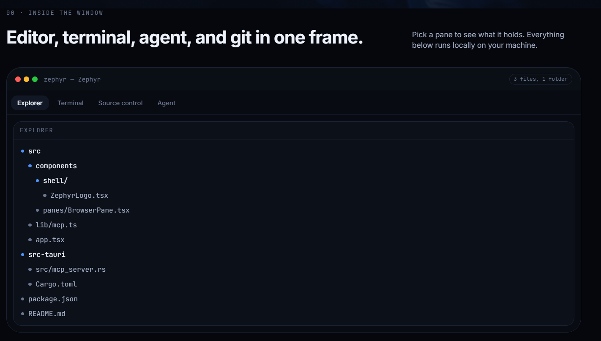

<div align="center">


# Zephyr — Website

**Source for the Zephyr landing page and documentation site.**
Zephyr is a small, open-source Windows code editor built on Tauri 2, Rust, and React.

[](https://shinryu04.github.io/zephyr-website)
[](https://nextjs.org)
[](LICENSE)

[Repository](https://github.com/ShinRyu04/Zephyr) · [Live site](https://shinryu04.github.io/zephyr-website) · [Changelog](https://shinryu04.github.io/zephyr-website/changelog)

</div>

<br />

<p align="center">
  
</p>

<br />

The editor lives in a separate repository: **[ShinRyu04/Zephyr](https://github.com/ShinRyu04/Zephyr)**. This repository is only the website.

## What's here

The site is a single marketing surface with a few supporting pages. Everything a visitor can reach:

| Route | What it is |
| --- | --- |
| `/` | Landing page: hero, a live pane demo, the interactive feature walkthrough, the toolkit grid, the screenshot gallery, downloads, install steps, and the FAQ |
| `/docs` | Documentation hub. Quickstart, MCP, AI, terminal, git, build, config, and support, with a sticky anchor nav |
| `/download` | Full download table with install steps and a verification section |
| `/changelog` | Release-by-release notes, with the current version highlighted |
| `/about` | Why the editor is built the way it is, and what it is built with |
| `/security` | Reporting, the MCP threat model, release signing, and what sits on disk |
| `/privacy` | What is collected (nothing) and what stays local |
| `/terms` | Short, plain terms |
| anything else | A styled 404 |

## Notable pieces

**The hero background** is a WebGL fragment shader, drawn with [OGL](https://github.com/oframe/ogl) — see [`components/visuals/gusts.tsx`](components/visuals/gusts.tsx). It layers fractional Brownian motion over five octaves, then pushes the result through a three-stop colour ramp. The field is static when the visitor asks for reduced motion.

**Theming** uses one set of token names declared twice in [`app/globals.css`](app/globals.css) — light on `:root`, dark under `.dark`. A blocking script in the document head picks the theme before the first paint, so reloading never flashes.

**The screenshot gallery** in [`components/site/screenshot-gallery.tsx`](components/site/screenshot-gallery.tsx) filters real captures by surface and opens them in a keyboard-navigable lightbox with a focus trap.

**The pane demo** in [`components/site/demo-window.tsx`](components/site/demo-window.tsx) is built from markup rather than an image, and switches between Explorer, Terminal, Source control, and Agent.

## Stack

Next.js 16 with the App Router, React 19, TypeScript strict, Tailwind CSS v4, OGL for WebGL. Static export only — no server runtime, no API routes, no database.

## Running it

Node 20 or newer, and pnpm.

```bash
pnpm install
pnpm dev
```

The dev server is at `http://localhost:3000`.

```bash
pnpm build       # static export into ./out
pnpm start       # serve the built export
pnpm typecheck   # tsc --noEmit
```

## Publishing

The export is plain HTML, so any static host will do. This repository deploys to GitHub Pages through [`.github/workflows/deploy.yml`](.github/workflows/deploy.yml): a push to `main` builds the site and publishes `./out`.

One-time setup: open **Settings → Pages** and set **Source** to **GitHub Actions**.

## Layout

```
app/                 routes and the root layout
components/site/     page sections, one file each
components/visuals/  shader background, scroll reveal, typing effect
lib/site.ts          version, links, and download data in one place
public/shots/        screenshots the gallery renders
```

To change the version shown across the site or swap a download link, edit [`lib/site.ts`](lib/site.ts). Nothing else hardcodes a release.

## License

Apache-2.0, the same license as the editor. See [LICENSE](LICENSE).
